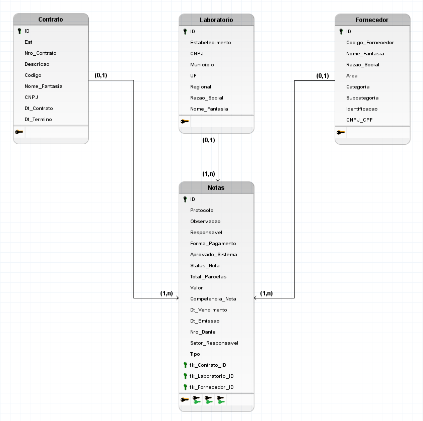
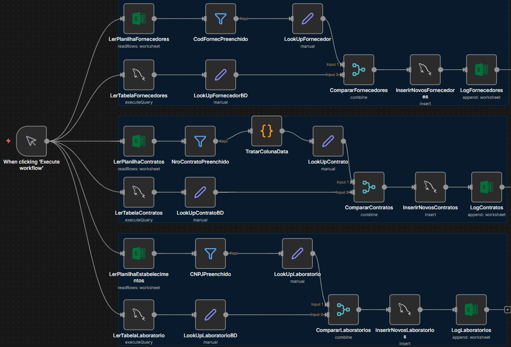
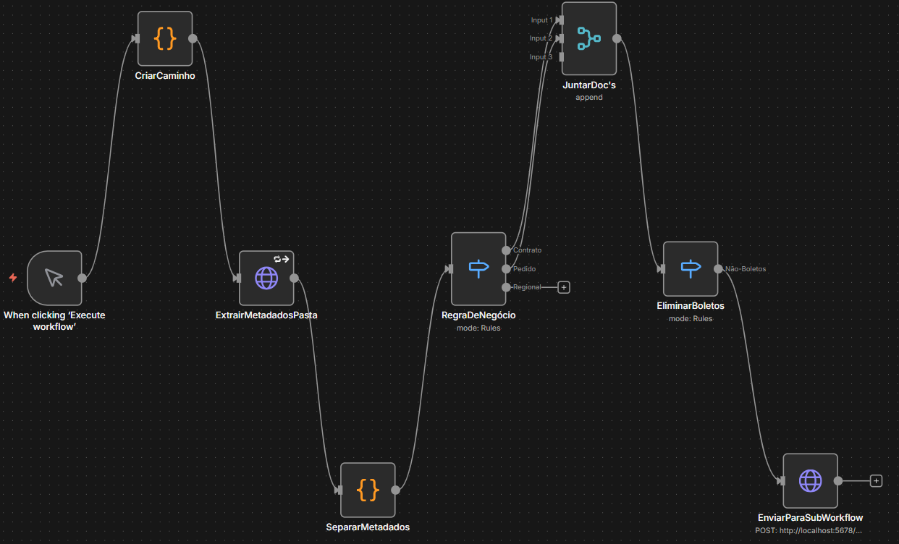
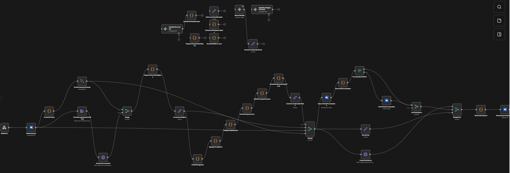

# Automação de Processos Financeiros e Gestão de Contratos (n8n + SQL)

> **Status do Projeto:** Em Produção (Maturidade: 7 meses)
> **Stack:** n8n (Workflow Automation), SQL (Banco de Dados Relacional), Wrike API, Microsoft Graph API, MySQL Workbench, brModelo.

## 🎯 Visão Geral

Este repositório documenta a transição de uma operação financeira manual e baseada em planilhas para um ecossistema automatizado, seguro e escalável. O projeto foi desenvolvido para orquestrar o ciclo de vida de notas fiscais, gestão de fornecedores e protocolização digital de documentos.

O objetivo central foi eliminar gargalos operacionais no departamento de Marketing, garantindo integridade de dados e liberando tempo humano para atividades analíticas.

---

## 🏗️ Arquitetura de Dados

Para sustentar as automações, a estrutura de dados foi migrada de planilhas descentralizadas para um Banco de Dados Relacional.

**Funcionamento do Modelo:**
O banco foi projetado sob a lógica de **Integridade Referencial**. A tabela `Notas` atua como a entidade central (Fato), recebendo chaves estrangeiras das dimensões `Contrato`, `Laboratório` e `Fornecedor`.
Essa estrutura impede a inserção de registros órfãos (ex: uma nota sem fornecedor vinculado) e centraliza as regras de validação cadastral diretamente na camada de dados, garantindo que o *Analytics* futuro seja baseado em dados consistentes e normalizados.

### Diagramas (Schema)

Abaixo, a representação visual da estrutura persistida:

| Modelo Conceitual (MER) | Modelo Lógico |
| :---: | :---: |
|  |  |
| *Visão macro dos relacionamentos (1:N)* | *Detalhamento de atributos, tipagem e chaves (PK/FK)* |

---

## ⚙️ Workflows de Automação

Abaixo detalho os três pilares da automação desenvolvida.

### 1. Automação de Ingestão de Notas Fiscais

**O Problema (Manual):**
O registro dependia de digitação manual de notas recebidas via e-mail/Wrike para o Excel.
* *Riscos:* Erros de digitação (valores/datas), perda de prazos e dificuldade de rastreabilidade.

**A Solução (Automated):**
Um fluxo que monitora a plataforma Wrike, extrai metadados da tarefa e realiza o enriquecimento dos dados.

**Destaques Técnicos:**
* **Tratamento de Exceções:** Implementação de nós de erro (*Error Trigger*) para capturar falhas e logar incidentes sem interromper a fila principal.
* **Lógica Condicional:** Verificação automática se o fornecedor já existe na base. Se não, dispara alerta para cadastro.
* **Atualização Automática:** Atualiza, após ingestão no banco, o status da tarefa na plataforma Wrike de `Fila Pagamento` -> `Recebido`. Sem necessidade de supervisão humana.
* **Padronização e Armazenamento (Hierarquia Rígida):**
    * *Naming Convention:* Renomeação automática de anexos para auditoria.
    * *Estrutura de Pastas:* Criação dinâmica de diretórios para organização lógica e fácil recuperação manual. A hierarquia segue o padrão:
        > `Ano (2025)` **>** `Ano/Mês (2025-02)` **>** `Dia/Mês (15-02)` **>** `Arquivos (.pdf)`

---

### 2. Sincronizador de Dimensões (Master Data Sync)

**O Problema (Manual):**
A coexistência temporária entre o legado (Excel) e o novo (Banco de Dados) gerava redundância e risco de "Dual Entry".

**A Solução (Automated):**
Middleware que atua como *SOT (Source of Truth)* synchronizer. Ele lê as planilhas e atualiza o banco apenas com deltas (novos registros).

**Destaques Técnicos:**
* **Estratégia de Lookup:** Utilização de nós de *Merge* para comparar o dataset do Excel com o dataset do SQL.
* **Otimização:** Apenas novos registros (Set "Insert") são processados, economizando recursos de I/O no banco.

---

### 3. Protocolo e Carimbo Digital (Arquitetura Main/Sub)

**O Problema (Manual):**
Impressão física de PDFs para carimbo, preenchimento manual de dados de protocolo, digitalização e reenvio. Extremamente lento e custoso.

**A Solução (Automated):**
Automação *End-to-End* que recebe o arquivo digital, aplica um carimbo virtual com dados dinâmicos do banco e arquiva.

**Decisão Arquitetural (Main vs. Sub Workflow):**
Optei por desacoplar a lógica em dois fluxos distintos (Orquestrador e Processador) para garantir **atomicidade e isolamento de escopo**.
* *Motivo:* Em testes iniciais unificados, o processamento simultâneo de múltiplos arquivos causava *Race Conditions*, onde um arquivo sobrescrevia o outro na memória temporária.
* *Resolução:* O Main itera sobre os itens e chama o Sub de forma isolada para cada arquivo.

#### 3.1 Main Workflow - O Orquestrador
Responsável por ouvir o gatilho, preparar os caminhos de diretório e decidir qual regra de negócio aplicar (Contrato vs. Pedido vs Regional).

#### 3.2 Sub Workflow - O Processador
Recebe o payload do Main, baixa o binário, alimenta os campos necessários via `Query` no banco de dados, calcula coordenadas do carimbo (coordenadas dinâmicas baseadas no layout) e devolve o arquivo processado armazenando na pasta devida dinamicamente.

---

## 🚀 Resultados e Métricas (KPIs)

Com base na operação dos últimos 7 meses:

* **Eficiência Operacional:** Redução do tempo de processamento de notas de **horas diárias para minutos**.
* **Qualidade de Dados:** Eliminação de **100% dos erros humanos** em digitação e classificação de arquivos.
* **Volume:** Capacidade de escalar o volume de notas processadas sem adição de headcount.
* **Sustentabilidade:** Eliminação de tratamento manual de arquivos físicos para fluxo de aprovação (*Paperless*).

---

## 💡 Melhoria Contínua e Feedback

Embora o projeto esteja estável e gerando valor, reconheço que *software* é um organismo vivo. Pontos que identifiquei para refatoração futura e onde **aceito sugestões da comunidade**:

1.  **Hardcoded Paths:** Alguns caminhos de pasta ainda são construídos via *string manipulation*. *Sugestão: Migrar para variáveis de ambiente globais.*
2.  **OCR vs. Layout:** O carimbo digital funciona bem para layouts padrão. Para notas muito atípicas, ainda há uma verificação visual rápida. *Próximo passo: Implementar OCR inteligente para identificar áreas em branco automaticamente.*
3.  **Monitoramento:** Atualmente o log é feito em planilha/tabela. *Sugestão: Implementar um dashboard em Grafana ou PowerBI conectado diretamente ao banco de logs.*

---
*Documentação gerada com base nos artefatos do projeto desenvolvidos por Andrey Henrique Rodrigues dos Santos.*
